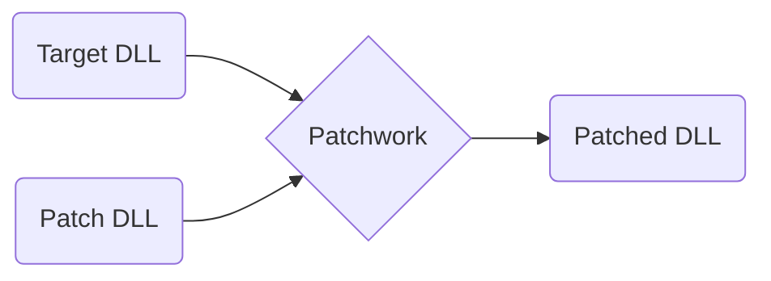

> [!infobox]
> 
> ![[Icon.png]]
> # [Patchwork](https://github.com/GregRos/Patchwork)
> 
> |  | |
> | ---- | ---- |
> | Type | Framework |
> | Platform | #dotnet #mono |
> | Role | Lead |
> | Period | 2015-2018 |
> | Users | 5-30 |
> | End-users | 50k-100k |
> | Contributors | 5 |

Patchwork is a framework for injecting custom code into #dotnet DLL files. It’s written in #csharp, for both .NET and #mono. It’s completely cross-platform, and has been used on all major operating systems.

Patchwork was written for game #modding

![[Projects/P_Patchwork/Achievements|no-title clean]]

# How it works

To use Patchwork, users wrote a Patch DLL – a DLL that has both custom code and patching instructions, in the form of declarative attributes from the `Patchwork.Attributes` package.

Patchwork has a launcher that takes the Patch DLL and a Target DLL, processes both DLLs, acting according to the patching instructions, and copies the MSIL code together with any declarations into the Target DLL.

This is harder than it sounds, because instructions and declarations in the Patch DLL contain references that can’t be copied as-is. Instead, they need to be translated into new references to types and members in the Patched DLL. This often involves navigating the complex structure of MSIL declarations.

This was especially tricky with specific types and syntax elements, such as generics, try-catch clauses, and attributes.

# Users
The first framework of its kind, it was used to make multiple mods, with over 50k+ unique mod downloads. However, I stopped maintaining it due to real life events, and it’s since been superseded by better tools.

[IE Mod](https://www.nexusmods.com/pillarsofeternity/mods/1?tab=files&file_id=824) (bundled), 50k+ unique DLs
[Pillars of Eternity 2](https://www.nexusmods.com/pillarsofeternity2/mods/231) (dependency), 12k unique DLs
