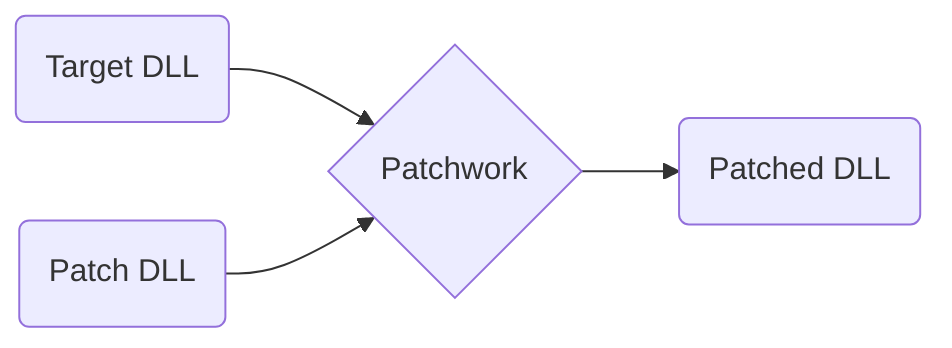

Patchwork is a framework for injecting custom code into #dotnet  DLLs. It’s written in #csharp and designed for game modding. It also runs on Linux and OSX using #mono.

![[Projects/P_Patchwork/Achievements|no-title clean]]

# Why I wrote it
Games that use the Unity game engine typically have game logic written in C# and compiled into DLLs. This framework lets modders write code that changes that logic.
# How it works

Patchwork takes a **Patch DLL** that contains custom code and patching instructions, and applies it to the **Target DLL**., resulting in the **Patched DLL**.
# Userbase
It was the first framework of its kind and it was used by several mods, with over 50k+ unique mod downloads. Today there are better options available so it’s rarely used.
- [IE Mod](https://www.nexusmods.com/pillarsofeternity/mods/1?tab=files&file_id=824) (bundled), 50k+ unique DLs
- [Pillars of Eternity 2](https://www.nexusmods.com/pillarsofeternity2/mods/231) (dependency), 12k unique DLs
