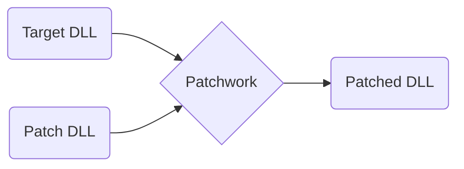

> [!infobox]
> | [Patchwork](https://github.com/GregRos/Patchwork) |Framework |
> | ---- | ---- |
> | Platform | #dotnet #mono |
> | Language| #csharp |
> | Role | Lead |
> | Period | 2015-2018 |
> | Users | 13-30 |
> | End-users | 50k-100k |
> | Contributors | 5 |

Patchwork is a framework for injecting custom code into #dotnet DLL files. It’s written in #csharp, for both .NET and #mono. It’s completely cross-platform, and has been used on all major operating systems.

Patchwork was written for game #modding
> [!column|no-title flex]
> > [!success] Simple API
> > Designed a simple API for a highly technical, low-level process.
> 
> > [!success] Universal support
> > Required a deep understanding of .NET and working closely with the MSIL spec.
> 
> > [!success] Cross-platform
> > Targeted both the .NET Framework and Mono.
> 
> > [!success] Up to 100k end-users
> > Framework’s usefulness attested by tens of thousands of gamers.
> 
> > [!warning] Success is the first step
> > Widespread adoption needs to be nurtured with constant maintenance for it to last.
> 
> > [!warning] Just use zip
> > If you need a special format for something, just use zip and change the extension.
# How it works

To use Patchwork, users wrote a Patch DLL – a DLL that has both custom code and patching instructions. A launcher would take the Patch DLL and combine it with a Target DLL, outputting a Patched DLL that included the custom code and the modifications.

Doing this was quite tricky. All references found in the Patch DLL had to be translated to the Patched DLL using a complicated, recursive process that dealt with the complexities of the MSIL type system.

# Users
The first framework of its kind, it was used to make multiple mods, with over 50k+ unique mod downloads. However, I stopped maintaining it due to real life events, and it’s since been superseded by better tools.

- [IE Mod](https://www.nexusmods.com/pillarsofeternity/mods/1?tab=files&file_id=824) (bundled), 50k+ unique DLs
- [Pillars of Eternity 2](https://www.nexusmods.com/pillarsofeternity2/mods/231) (dependency), 12k unique DLs
